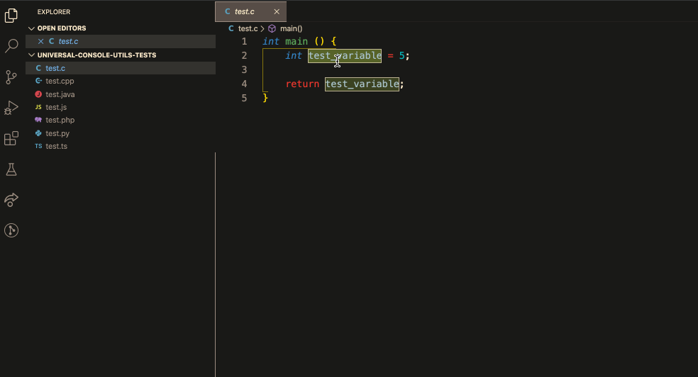
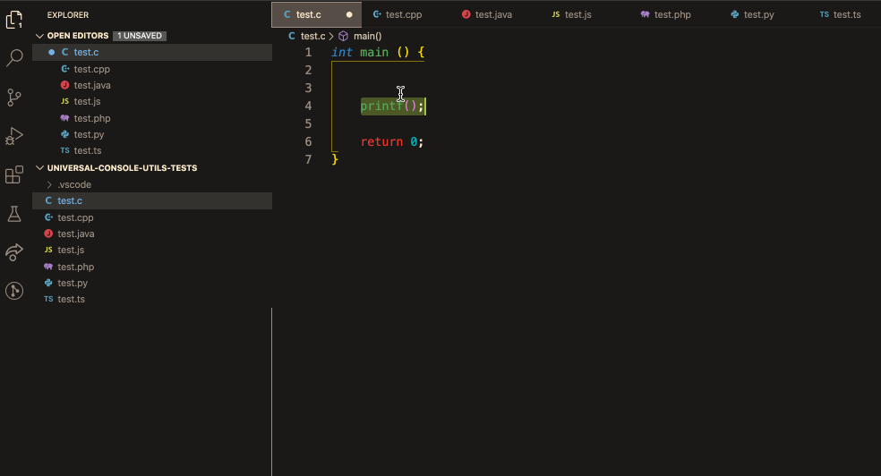

# Universal Console Utils

This extension is built to ease inserting log (print) statements while coding.

### Demo with Selected Text



### Demo Blank Mode



## Getting started

You can install this awesome extension through the [Visual Studio Code Marketplace](https://marketplace.visualstudio.com/items?itemName=omergulen.universal-console-utils).

### Installation

Launch *Quick Open*:
  -  <a href="https://code.visualstudio.com/shortcuts/keyboard-shortcuts-linux.pdf">Linux</a> `Ctrl+P`
  -  <a href="https://code.visualstudio.com/shortcuts/keyboard-shortcuts-macos.pdf">macOS</a> `⌘P`
  -  <a href="https://code.visualstudio.com/shortcuts/keyboard-shortcuts-windows.pdf">Windows</a> `Ctrl+P`

Paste the following command and press `Enter`:

```shell
ext install universal-console-utils
```

And pick the one by **Universal Console Utils (Omer Gulen)** (me) as author.

##### GitHub Repository Clone

Change to your `.vscode/extensions` [VS Code extensions directory](https://code.visualstudio.com/docs/extensions/install-extension#_side-loading).
Depending on your platform it is located in the following folders:

  -  **Linux** `~/.vscode/extensions`
  -  **macOs** `~/.vscode/extensions`
  -  **Windows** `%USERPROFILE%\.vscode\extensions`

Clone the Universal Console Utils repository as `omergulen.universal-console-utils`:

```shell
git clone https://github.com/omergulen/universal-console-utils.git omergulen.universal-console-utils
```

## Usage

By default `Alt + Shift + L` (`Option + Shift + L` for Mac) key combination inserts the most common print statement of the language.

Also, if there is a selection in the editor, it inserts a print statement with that selection. It's like a shortcut for printing variables to the console.

## Roadmap

<table>
    <thead>
        <tr>
            <th>Steps/Status</th>
            <th>Issue</th>
            <th>Language Support</th>
            <th>Functionality Support</th>
            <th>Testing</th>
        </tr>
    </thead>
    <tbody>
        <tr>
            <td>TO-DO</td>
            <td>Refactor code</td>
            <td></td>
            <td></td>
            <td rowspan=6>Testing</td>
        </tr>
        <tr>
            <td>DONE</td>
            <td>Handle multi-selection</td>
            <td rowspan=5>Support more languages</td>
        </tr>
        <tr>
            <td>TO-DO</td>
            <td>Let users to edit config file</td>
            <td rowspan=4>Support more functions (delete logs etc.)</td>
        </tr>
        <tr>
            <td>TO-DO</td>
            <td>Handle back-tick, sing and double quotes</td>
        </tr>
        <tr>
            <td>TO-DO</td>
            <td>Save/Apply config files to/from Gist's</td>
        </tr>
        <tr>
            <td>TO-DO</td>
            <td>More configuration</td>
        </tr>
    </tbody>
</table>

## Contribution

Bug reports and pull requests are welcome on GitHub at https://github.com/omergulen/universal-console-utils. This project is intended to be a safe, welcoming space for collaboration, and contributors are expected to adhere to the Contributor Covenant code of conduct

## License

The repo is available as open source under the terms of the [MIT License](http://opensource.org/licenses/MIT).

